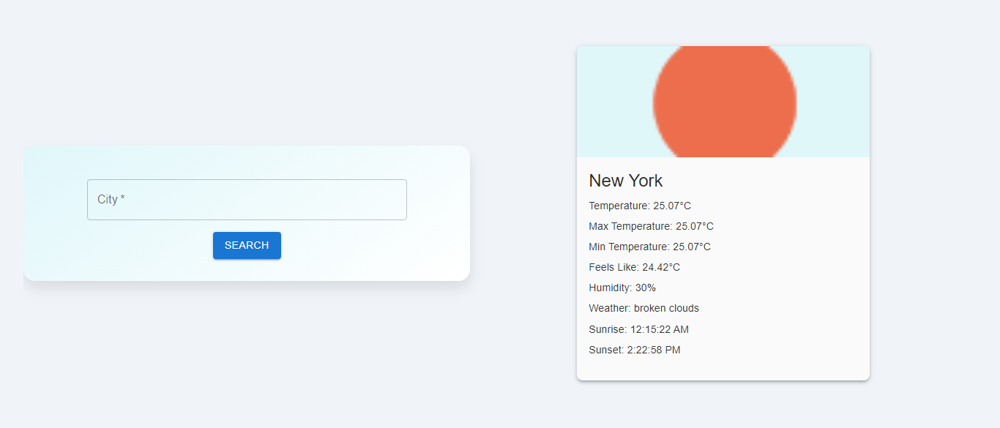

# React-Weather App

The React-Weather App is a simple web application built with React and Vite that allows users to search for weather information by city name. It leverages the OpenWeatherMap API to fetch real-time weather data.



## Features

- Search for weather information by city name
- Display current weather conditions including temperature, humidity, and weather description
- Show additional details such as maximum and minimum temperature, feels like temperature, sunrise, and sunset times
- Responsive design for optimal viewing on various devices

## Technologies Used

- React: A JavaScript library for building user interfaces
- Vite: A blazing fast build tool that provides instant server start and hot module replacement (HMR) for React applications
- Material-UI: A popular React UI framework for building stylish and responsive web applications
- OpenWeatherMap API: An API that provides weather data for any location worldwide

## Installation

To run the React-Weather App locally on your machine, follow these steps:

1. Clone this repository to your local machine:

   ```
   git clone <repository-url>
   ```

2. Navigate to the project directory:

   ```
   cd react-weather-app
   ```

3. Install dependencies using npm:

   ```
   npm install
   ```

4. **Add Your API Key**: Obtain an API key from OpenWeatherMap by signing up at [OpenWeatherMap API](https://openweathermap.org/api) and replace `"YOUR_API_KEY"` with your actual API key in the `SearchBox.jsx` file:

   ```javascript
   let API_KEY = "YOUR_API_KEY";
   ```

5. Start the development server:

   ```
   npm run dev
   ```

6. Open your web browser and visit `http://localhost:####` to view the React-Weather App.

## Usage

1. Enter the name of the city for which you want to check the weather in the search input field.
2. Click on the "Search" button or press Enter to retrieve the weather information.
3. View the current weather conditions along with additional details displayed on the screen.

## Responsive Design

The React-Weather App is designed to be responsive and optimized for viewing on various devices, including desktops, tablets, and mobile phones.

## Credits

- Weather data provided by [OpenWeatherMap](https://openweathermap.org/)

## License

This project is licensed under the [MIT License](LICENSE).
